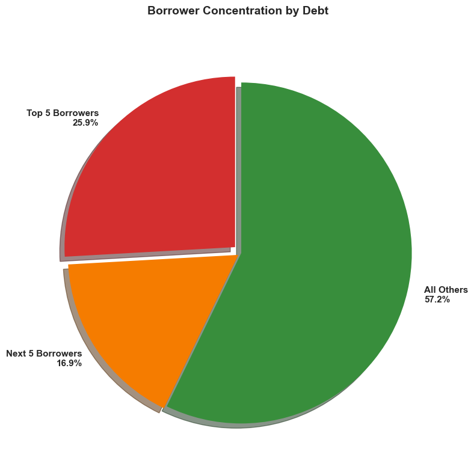
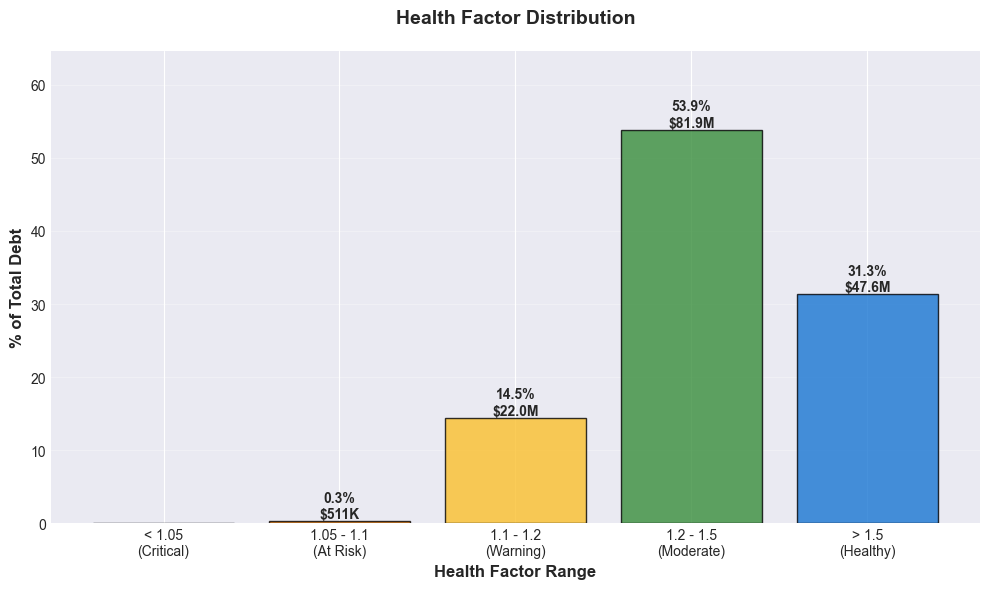
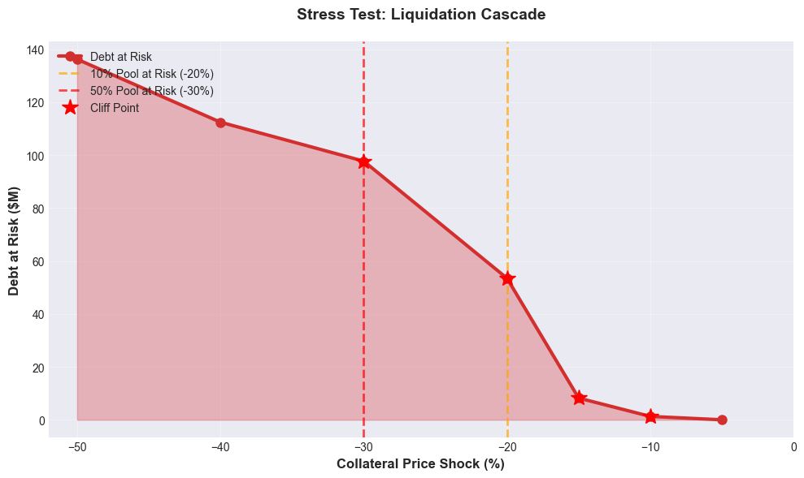

# Risk Analysis Report: WBTC/USDC Morpho Blue pool

**Generated:** 2025-12-30 14:15:26 UTC

**Overall Risk Score:** 33.0/100 (LOW)

## Executive Summary

**LOW RISK**: Pool appears relatively healthy with minor risk factors.

**Key Findings:**
- Total Value Locked: $209.14M
- Utilization Rate: 74.6%
- Active Positions: 336
- Unhealthy Positions: 0 (0.0% of total)
- Primary Risk Factor: Utilization (Score: 59.1/100)

## Pool Overview

| Metric | Value |
|--------|-------|
| **Market ID** | `0x3a85e619751152...` |
| **Liquidation Threshold (LLTV)** | 86.0% |
| **Total Supply** | $209.14M |
| **Total Borrow** | $155.93M |
| **Utilization Rate** | 74.56% |
| **Total Collateral** | $283.33M |
| **Total Debt** | $151.96M |
| **Average Health Factor** | 40.111 |
| **Weighted Avg Health Factor** | 1.604 |

## Risk Metrics Analysis

### Concentration Risk

| Metric | Value |
|--------|-------|
| **Top 5 Borrowers** | 25.9% of debt ($39.35M) |
| **Top 10 Borrowers** | 42.8% of debt ($65.05M) |
| **Gini Coefficient** | 0.862 |
| **Herfindahl Index** | 289 |

### Health Factor Distribution

Distribution of debt by health factor ranges:

| Health Factor Range | % of Total Debt |
|---------------------|-----------------|
| **< 1.05 (Critical)** | 0.0% |
| **1.05 - 1.1 (At Risk)** | 0.3% |
| **1.1 - 1.2 (Warning)** | 14.5% |
| **1.2 - 1.5 (Moderate)** | 53.9% |
| **> 1.5 (Healthy)** | 31.3% |

## Stress Test Results

Testing pool resilience under collateral price shocks:

| Price Shock | Liquidatable Positions | Debt at Risk | % of Pool | Bad Debt Potential |
|-------------|------------------------|--------------|-----------|-------------------|
| -5% | 0 | $0.00 | 0.0% | $0.00 |
| -10% | 7 | $1.27M | 0.8% | $0.00 |
| -15% | 24 | $8.21M | 5.4% | $0.00 |
| -20% | 55 | $53.46M | 35.2% | $152.67 |
| -30% | 129 | $97.68M | 64.3% | $1.28M |
| -40% | 189 | $112.40M | 74.0% | $11.59M |
| -50% | 246 | $136.18M | 89.6% | $27.53M |

### Cliff Points Detected

Found 4 sharp risk increases (positions clustered at similar health factors):

- **-5% to -10%**: inf% risk increase (7.0 new liquidations)
- **-10% to -15%**: 545% risk increase (17.0 new liquidations)
- **-15% to -20%**: 551% risk increase (31.0 new liquidations)
- **-20% to -30%**: 83% risk increase (74.0 new liquidations)

### Liquidation Thresholds

- **10% of pool at risk** at: -20% price shock
- **50% of pool at risk** at: -30% price shock

## Top 10 Borrowers

| Rank | Address | Debt | Health Factor | Status |
|------|---------|------|---------------|--------|
| 1 | `0xd674...a7da` | $12.50M | 1.808 | Healthy |
| 2 | `0x4fde...57f4` | $7.43M | 1.399 | Healthy |
| 3 | `0x0567...c388` | $6.62M | 1.193 | Warning |
| 4 | `0x317d...9318` | $6.44M | 1.193 | Warning |
| 5 | `0xc077...7587` | $6.35M | 1.326 | Healthy |
| 6 | `0xac79...6683` | $5.50M | 1.279 | Healthy |
| 7 | `0x930a...4b19` | $5.31M | 1.234 | Healthy |
| 8 | `0x86d8...c8d6` | $5.06M | 2.223 | Healthy |
| 9 | `0x34a8...49bc` | $5.03M | 1.334 | Healthy |
| 10 | `0x5cdb...eaba` | $4.80M | 1.213 | Healthy |

---

**Report generated by Risk Monitor** | [View Source](https://github.com/strohy/risk-monitor)

*This report is for informational purposes only. Always verify data independently before making decisions.*